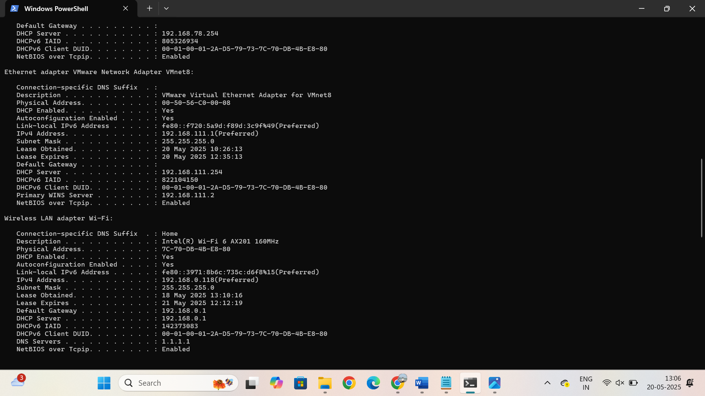

# Scenario 1: DNS Not Resolving

### 📝 Problem
A user reports that they are unable to access websites using domain names (like `google.com`), but they can still access websites directly through their IP addresses.

### 🔍 Diagnosis Steps & Output

```bash
ping google.com
```
**Result:** Request timed out or “could not find host”.


```bash
ping 8.8.8.8
```
**Result:** Ping successful, showing that the internet connection is working.


```bash
nslookup google.com
```
**Result:** DNS request times out or fails to resolve the domain name.


```bash
ipconfig /all
```
**Result:** DNS server IP is blank, misconfigured, or points to an unreachable server.



### 🧠 Root Cause
The device's DNS server configuration was incorrect or unreachable. This caused failures when trying to resolve domain names, even though raw IP connectivity was available.

### 🔧 Resolution
Update DNS settings to use a public DNS server such as Google DNS:

```bash
netsh interface ip set dns "Wi-Fi" static 8.8.8.8
ipconfig /flushdns
```

Re-test:
```bash
ping google.com
```
**Result:** Now successfully resolves and receives replies.

### 🛡️ Prevention Tips
- Use automatic DNS configuration via DHCP if available.
- Alternatively, manually set reliable public DNS such as:
  - Google DNS: `8.8.8.8` and `8.8.4.4`
  - Cloudflare DNS: `1.1.1.1`
- Regularly check adapter settings, especially after system changes or VPN installs.
- Train users to distinguish between DNS issues and full connectivity outages.

**Tags:** `#DNS`, `#Networking`, `#Troubleshooting`, `#HelpDesk`, `#Windows`
